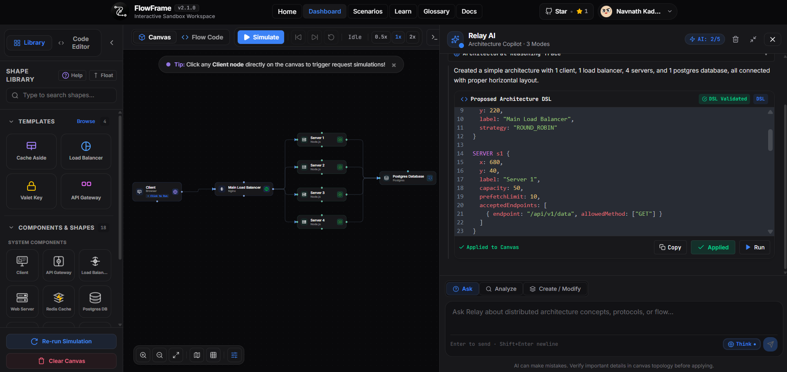
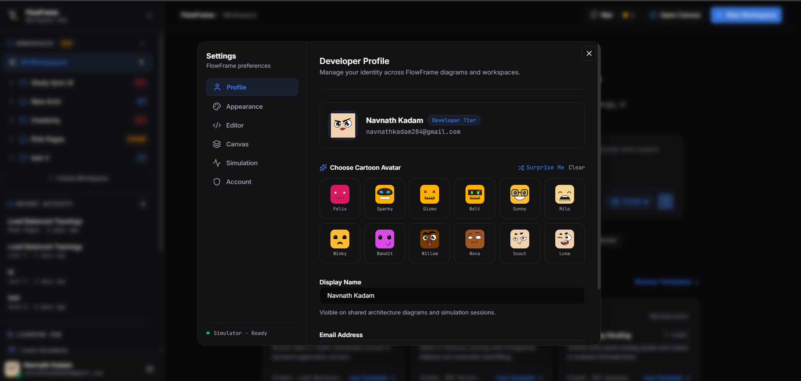
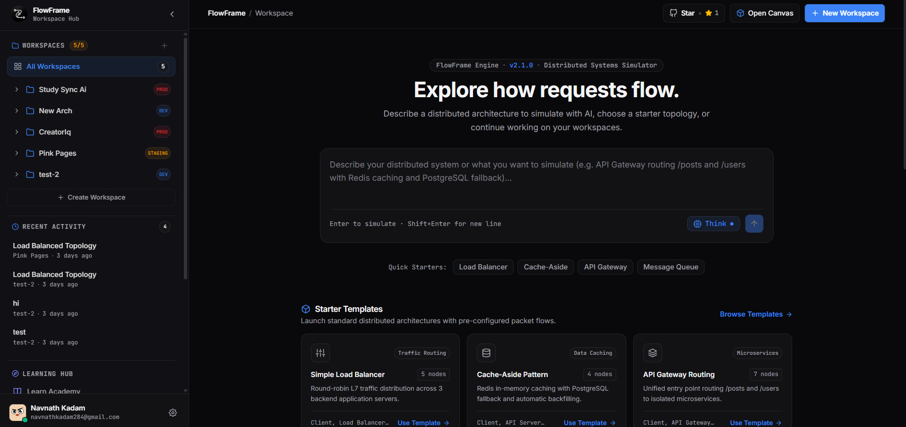
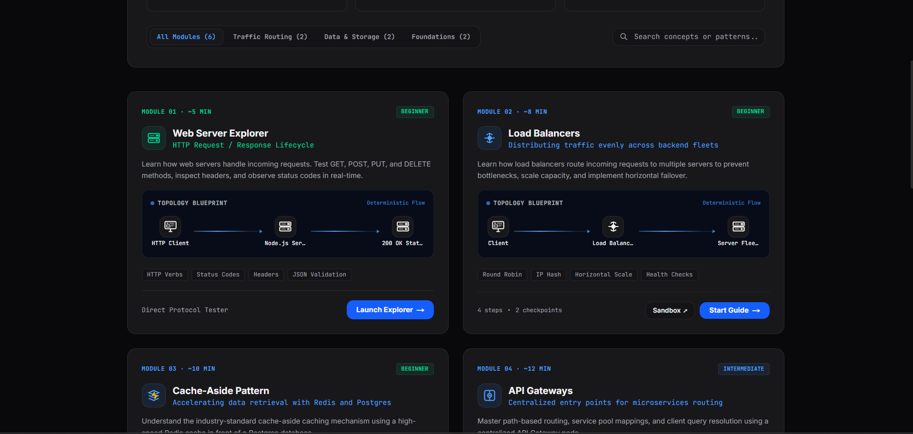

# FlowFrame

<p align="center">
  
</p>

<b>
<p align="center">
  Interactive distributed systems simulator to design, test, and understand architecture behavior frame by frame.
</p>
</b>

## Overview

FlowFrame is a full-stack platform for visualizing distributed systems behavior through simulation rather than static diagrams.
It combines a modern Next.js frontend with a high-performance Rust Axum backend for authentication, workspace management,
diagram persistence, and recent activity feeds.

Primary use cases:

- Learn distributed systems with interactive scenarios
- Prototype architecture designs in a visual canvas
- Simulate request traversal and observe component-level behavior
- Persist and manage diagrams across workspaces

## Quick Referral Links

- Product demo: https://youtu.be/3Tezcle9FUY
- Rust backend repository: https://github.com/ndk123-web/flowframe-backend
- Frontend setup guide: [Local Setup](#local-setup)
- Backend integration notes: [Backend Integration (Rust Axum)](#backend-integration-rust-axum)
- License: [License](#license)

## Product Demo

- YouTube demo: https://youtu.be/3Tezcle9FUY

## Screenshots

Sample screenshots are available in the public folder:






## Architecture

FlowFrame is split into two repositories:

- Frontend (this repository): Next.js app, simulation UI, engine, and learning experience
- Backend (Rust + Axum): API, auth, workspace and diagram persistence

Backend repository:

- https://github.com/ndk123-web/flowframe-backend

## FlowFrame DSL (Domain-Specific Language)

FlowFrame includes a separate, purpose-built DSL for defining distributed architectures declaratively.
This DSL is designed for system modeling, not general-purpose programming.

What you can express in `.flow` scripts:

- Infrastructure node definitions using `define <TYPE> <id> { ... }`
- Directed topology using `connect a -> b -> c` or direct arrow chains
- Runtime-related configs such as routes, endpoints, multi-hop pipelines, capacities, cache data, topics, and queue behavior

Supported high-level node types include:

- CLIENT
- SERVER
- GATEWAY
- LOADBALANCER
- REDIS
- POSTGRES
- MESSAGEQUEUE
- PUBSUB

### DSL Compilation Pipeline

The DSL compiler entry point is implemented in `src/DSL/index.ts` as `compileDSL(sourceCode)`.

Compilation flow:

1. Lexing: source text to tokens
2. Parsing: tokens to AST
3. Semantic analysis: AST validation and normalization
4. Interpretation: semantic AST to graph output consumed by FlowFrame

Implementation modules:

- Lexer: `src/DSL/flow-interpreter/src/flowLexer/lexer.ts`
- Parser: `src/DSL/flow-interpreter/src/flowParser/parser.ts`
- Semantic analyzer: `src/DSL/flow-interpreter/src/flowSemantic/semantic`
- Interpreter: `src/DSL/flow-interpreter/src/flowInterpreter/interpreterFlow`

Reference documentation:

- `src/DSL/README.md`

Example with Dynamic Multi-Hop Pipeline:

```flow
define CLIENT c1 {
  label: "Mobile Client",
  requests: [
    {
      endpoint: "/api/v1/posts",
      allowedMethods: ["GET"],
      key: "posts"
    }
  ]
}

define SERVER s1 {
  label: "Posts Service",
  acceptedEndpoints: [
    {
      endpoint: "/api/v1/posts",
      allowedMethod: ["GET"],
      pipeline: ["r1", "db1"]
    }
  ]
}

define REDIS r1 {
  label: "Posts Cache",
  data: [{ key: "posts", value: "cached posts data" }]
}

define POSTGRES db1 {
  label: "Primary DB",
  table: "posts",
  data: [{ key: "posts", value: "db posts data" }]
}

connect c1 -> s1
connect s1 -> r1
connect s1 -> db1
```

## Core Features

- **Interactive System Design Canvas**: Drag-and-drop distributed topology design with real-time connection routing.
- **Dynamic Endpoint Execution Pipelines**: Configure discrete service execution chains (e.g. `Client -> Server -> Redis -> Postgres -> Server -> Client`) per endpoint route with custom traversal ordering.
- **Architecture Presets**: One-click configuration for standard patterns:
  - Cache-Aside Pattern (`[Redis, Postgres]` with Stop-on-Hit enabled)
  - Strict Sequence / Write-Through (`[Redis, Postgres]` or `[Postgres, Redis]`)
  - Direct Database Queries (`[Postgres]`)
  - Auto-Discovery fallback
- **Cache Hit / Miss Policy Modeling**: Stop-on-Hit toggle to simulate instant memory retrieval on cache hits vs. database query fallthrough on misses.
- **Hop-by-Hop Latency Profiling**: Real-time estimated latency breakdowns (+2ms Redis, +45ms Postgres, +8ms Queue, +6ms PubSub) and aggregated roundtrip response timing (`~22ms (HIT)` / `~74ms (MISS)`).
- **Frame-Based Simulation Engine**: Step-by-step deterministic packet animation over network edges with real-time log traces.
- **Domain-Specific Language (DSL)**: Code-first architecture modeling with instant compilation to interactive visual graphs.
- **Authenticated Workspaces & Persistence**: Cloud diagram persistence, versioning, and CRUD operations via high-performance Rust Axum backend.

## Backend Integration (Rust Axum)

The frontend uses NEXT_PUBLIC_API_URL to call the Rust backend. If not set, it defaults to:

- http://127.0.0.1:8000

Client service modules calling backend APIs:

- src/services/authApi.ts
- src/services/workspaceApi.ts
- src/services/diagramApi.ts

Key API groups consumed by frontend:

- Auth: /api/auth/signup, /api/auth/signin, /api/auth/sync
- Workspaces: /api/workspaces
- Diagrams: /api/workspaces/:id/diagrams, /api/diagrams/recent

## Tech Stack

Frontend:

- Next.js 16
- React 19
- TypeScript
- Tailwind CSS 4
- React Flow (@xyflow/react)
- Framer Motion
- Firebase Auth
- Vitest

Backend (separate repo):

- Rust
- Axum
- Tokio
- MongoDB
- JWT-based auth middleware

## Project Structure

```text
app/                 Next.js App Router pages
public/              Static assets and screenshots
src/components/      UI and visualization components
src/engine/          Simulation core and routing strategies
src/scenarios/       Scenario builders and registry map
src/services/        Frontend API clients for Rust backend
tests/               Unit tests
```

## Local Setup

### Prerequisites

- Node.js 20+
- npm 10+
- Rust toolchain (for backend repository)
- MongoDB instance (for backend repository)

### 1) Run Backend (Rust Axum)

Clone and start backend from:

- https://github.com/ndk123-web/flowframe-backend

Typical backend environment values:

```env
MONGODB_URI=mongodb://localhost:27017
DATABASE_NAME=flowframe
JWT_SECRET=change_me
HOST=0.0.0.0
PORT=8000
FRONTEND_URL=http://localhost:3000
```

Then run backend:

```bash
cargo check
cargo run
```

### 2) Run Frontend (this repository)

Create .env.local in this repository:

```env
NEXT_PUBLIC_API_URL=http://127.0.0.1:8000
NEXT_PUBLIC_APP_URL=http://localhost:3000

# Firebase client config
NEXT_PUBLIC_FIREBASE_API_KEY=your_key
NEXT_PUBLIC_FIREBASE_AUTH_DOMAIN=your_domain
NEXT_PUBLIC_FIREBASE_PROJECT_ID=your_project_id
NEXT_PUBLIC_FIREBASE_STORAGE_BUCKET=your_bucket
NEXT_PUBLIC_FIREBASE_MESSAGING_SENDERID=your_sender_id
NEXT_PUBLIC_FIREBASE_APPID=your_app_id
NEXT_PUBLIC_FIREBASE_MEASUREMENTID=your_measurement_id
```

Install and run:

```bash
npm install
npm run dev
```

Open:

- http://localhost:3000

## Available Scripts

- npm run dev: Start development server
- npm run build: Build for production
- npm run start: Start production build
- npm run lint: Run lint checks
- npm run test: Run test suite once
- npm run test:watch: Run tests in watch mode

## Routes

- Home: /
- Dashboard: /dashboard
- Workspaces: /workspace
- Scenarios: /scenarios
- Learning Hub: /learn
- Docs: /docs

## License

This frontend repository is licensed under PolyForm Noncommercial License 1.0.0.

- License file: [LICENSE.txt](LICENSE.txt)
- Official text: https://polyformproject.org/licenses/noncommercial/1.0.0

Noncommercial usage is allowed under the license terms.
